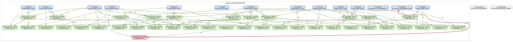
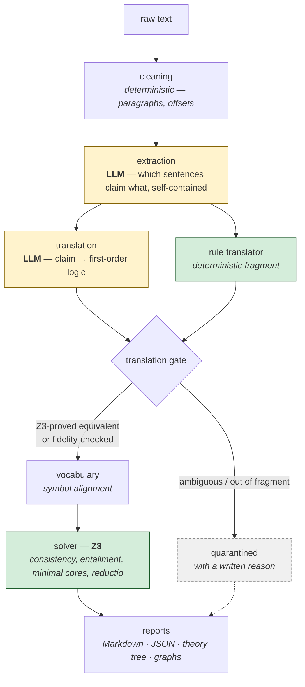

# Internal-Inconsistency Checker

**Finds logical contradictions in a document by translating its claims into formal
logic and proving inconsistency — including conflicts that span several statements.**

Give it a text file. It extracts every claim, translates each into first-order
logic, and hands the result to the Z3 theorem prover. What comes back is not a
similarity score or a model's opinion: it is a **proof**. When statements cannot
all be true, you get the *minimal* set that conflicts and a step-by-step
derivation of the contradiction. When they are consistent, you get the author's
argument reconstructed as a theory tree — axioms, theorems, and which premises
each conclusion actually rests on.

The point is multi-hop contradictions that no amount of sentence-pair comparison
will catch. "All members are subscribers," "all subscribers are users," "all users
have access," "Devon is a member," "Devon does not have access" — five sentences,
no two of which contradict each other, that cannot all be true together.

---

## What it looks like

```
$ python -m consistency_checker.main --file examples/t4_direct_contradiction.txt --offline

id     type               gate         verdict        statement
--------------------------------------------------------------------------------
s1     axiom              accepted     contradicts    All witnesses are reliable.
s2     axiom              accepted     contradicts    The clerk is a witness.
s3     derived_claim      accepted     contradicts    The clerk is not reliable.

INCONSISTENT SET {s1, s2, s3}: these cannot all be true; at least one must be
abandoned (the system does not pick which)

DERIVATION OF THE CONTRADICTION (forward-chained refutation)
|-- both derived:  not Reliable(clerk)   ><   Reliable(clerk)
|-- chain A:
|   `-- [s3] not Reliable(clerk)
`-- chain B:
    `-- Reliable(clerk)  (by s1)
        `-- [s2] Witness(clerk)
```

Note what it does **not** do: it does not tell you which statement is wrong. An
inconsistency is a property of a *set*. Deciding which member to abandon is the
author's job, not the tool's.

---

## A harder example: a contradiction nothing states

The tool's real target is a contradiction that no single sentence contains. Here
is a real MIT course catalog with **one fabricated prerequisite** added
(`6.100A requires 6.5060`). No sentence is false-looking; the conflict only exists
across seven of them, and only once transitivity is applied:

```
DERIVATION OF THE CONTRADICTION (forward-chained refutation)
|-- both derived:  not Require(c6100a, c6100a)   ><   Require(c6100a, c6100a)
|-- chain A:
|   `-- [s14] not Require(c6100a, c6100a)          "No course is a prerequisite for itself."
`-- chain B:
    `-- Require(c6100a, c6100a)  (by s13)           ← transitivity closes the cycle
        |-- [s3] Require(c61010, c6100a)
        `-- Require(c6100a, c61010)  (by s13)
            |-- Require(c61060, c61010)  (by s13)
            |   |-- [s5] Require(c61020, c61010)
            |   `-- [s8] Require(c61060, c61020)
            `-- Require(c6100a, c61060)  (by s13)
                |-- [s11] Require(c65060, c61060)
                `-- [s15] Require(c6100a, c65060)   ← the planted edge
```

Every run also emits the same structure as a graph. Blue = axioms, green =
derived, red = the contradiction where the two chains collide:



*(Click for full size — wide graphs are a known rendering limitation.)*

---

## Install & run

Requires Python 3.10+ (tested on 3.12).

```bash
git clone https://github.com/ariamousavifar/consistency-checker.git
cd consistency-checker

python3 -m venv .venv && source .venv/bin/activate   # Windows: .venv\Scripts\activate
pip install -r requirements.txt
```

Run commands **from the project root** — the pipeline resolves `examples/` and
`providers.json` relative to the working directory.

**Offline mode needs no API key at all** — the shipped fixtures drive the entire
downstream pipeline, so you can see the whole thing work before configuring
anything:

```bash
python -m consistency_checker.main --file examples/sample_essay.txt --offline
python -m consistency_checker.main --tier 1 --offline          # a whole tier of examples
python -m pytest -q                            # 255 tests, ~2s, all offline
```

For your own documents you need a model. Copy your key into `.env`
(`CEREBRAS_API_KEY`, `GROQ_API_KEY`, `NIM_API_KEY`, …), then:

```bash
LLM_EXTRACTION_EFFORT=low LLM_TRANSLATION_EFFORT=medium \
python -m consistency_checker.main --file your_document.txt --provider groq --model openai/gpt-oss-120b --seed 7
```

Everything lands in `results/<run>/`: `report.md`, `report.json`, `store.json`,
`theory_tree.txt`, `graph.svg` (standalone, opens in any browser), `graph.dot`,
`graph.png` (if Graphviz is installed), `timing.json`.

---

## How it works



Yellow is where a language model is used; green is deterministic, auditable code.
Note where the boundary falls: **the LLM proposes, Z3 disposes.**

Four commitments run through the code:

**The LLM never decides logic.** It does natural-language work — spotting claims,
rendering them as formulas. Every logical verdict comes from Z3. Vocabulary
normalization, equivalence checking, minimization, and reporting are auditable
code, not model output.

**Nothing is silently dropped.** A statement is accepted, flagged ambiguous, or
quarantined *with a written reason* that appears in the report. If the tool
ignored a sentence, it tells you which one and why.

**Precision over recall.** A manufactured contradiction destroys trust in a way a
missed one does not. When a construction is out of scope — modality, tense,
causation, hedged generalizations — it is refused rather than forced into a
formula that would produce a false alarm.

**Provenance end to end.** Every statement carries character offsets into the
original file; contradiction reports quote the source sentences.

---

## What it handles, and what it refuses

Handled: universals and instances, multi-hop chains, negation, conditionals and
disjunction (`--allow-conditionals`), binary relations over the decidable EPR
fragment (`--allow-relations`), reductio ad absurdum, and user-supplied background
premises (`--bridges`) that are always tagged as assumptions rather than smuggled
in silently.

Deliberately refused, with a recorded reason:

- **Tense and modality.** "I will not raise taxes" followed by raising them is a
  broken promise — hypocrisy across time, not `P ∧ ¬P`. Tenseless first-order
  logic is *right* to decline it. Catching it would mean discarding the very tense
  information that makes the two statements compatible.
- **Causation and comparatives** — no faithful FOL rendering.
- **Hedged generalizations.** "Birds typically fly" is not `∀x`. Treating it as one
  manufactures a contradiction the moment a penguin appears.
- **Attributed belief.** Reporting someone else's view is not asserting it.
- **∀∃ role restrictions over relations** — outside the decidable fragment; needs
  description logic.

Known weak spots, honestly: the fidelity check is a lexical-coverage heuristic
rather than true entailment, so it catches invented predicates but not subtle
meaning drift; vocabulary alignment is deterministic and curated, so paraphrased
contradictions across unrelated predicate names can still be missed; input is
plain text only.

---

## Research context

**The problem.** Detecting whether a document contradicts *itself* is not the same
problem as recognising textual entailment. A contradiction can be distributed
across a chain of statements such that no pair of sentences is inconsistent —
the five-sentence example at the top of this README is the minimal case.
Pairwise entailment models cannot reach these by construction, because the
conflict does not exist in any pair; it only appears after inference over the
whole set.

**The approach and what is claimed.** Claims are extracted and translated into
first-order logic, and every logical judgement is discharged to an SMT solver
(Z3). The language model performs only linguistic work — identifying claims and
proposing formulas — while consistency, entailment, and minimality are decided
symbolically. Four properties follow from that separation:

1. **Verdicts are proofs, not predictions.** An inconsistency is reported only
   when a set is provably unsatisfiable, and what is returned is the *minimal*
   such set, obtained by deletion-based core shrinking.
2. **Explanations are constructive.** Because an inconsistent set entails
   everything, a solver cannot show *how* a contradiction arises. A separate
   forward-chaining step re-derives the two colliding chains, so the output is a
   derivation rather than a flag.
3. **Translation is not trusted on the model's word.** Two independent
   translators — one deterministic, one neural — must either be proved
   equivalent in Z3 or survive a fidelity check before a formula is admitted.
4. **Refusal is explicit.** Content outside the supported fragment is
   quarantined with a stated reason, which makes the system's coverage
   measurable rather than implicit.

**Decidability.** The base fragment is monadic first-order logic. Relational
reasoning is admitted within the Bernays–Schönfinkel (EPR) class, and formulas
that escape it — a universal with an existential in its scope linked by a
relation — are detected and set aside rather than passed to the solver with no
guarantee of termination.

**Relation to existing work.** Deterministic semantic parsing into logical form
has a long history: Attempto Controlled English achieves unambiguous translation
by constraining the input language; Boxer and ccg2lambda derive logical forms
compositionally from CCG derivations; UDepLambda does so from Universal
Dependencies; the English Resource Grammar produces scope-underspecified
representations via HPSG. These are exact on the fragment they cover and refuse
outside it. Purely neural approaches invert the trade-off, covering arbitrary
text without guarantees. This project sits deliberately between the two: neural
breadth for translation, symbolic rigour for every decision that follows, and an
arbitration layer between them. The measured cost of that choice is reported
honestly — the deterministic translator currently covers only a small fraction
of real sentences, and closing that gap is the primary line of ongoing work.

**Evaluation status.** Validated to date on synthetic multi-hop chains, real
encyclopaedic prose, chunk-spanning contradictions, and adversarial argumentative
text. Evaluation against labelled self-contradiction corpora (ContraDoc,
WikiContradict, and the self-contradiction data of Mündler et al.) is the next
milestone and requires the scoring harness described in the roadmap. Note that
recall is bounded by translation coverage rather than by the reasoning layer,
which is the property the roadmap targets first.

**Reproducibility.** The full test suite (255 tests) runs offline against shipped
fixtures in roughly three seconds with no API access, and the pipeline itself can
be run end-to-end in the same way, so published behaviour can be reproduced
without credentials or cost. Runs are deterministic at fixed seed and
temperature; where a language model is involved, the provider and model are
recorded with the results, because identical models on different infrastructure
have been observed to produce different formulas.

---

## Reference

**Fragment flags** (opt-in, each widens what reaches the solver):
`--allow-conditionals` (if/then, either/or, deontic reification) ·
`--allow-relations` (binary relations, EPR) · `--guard-deontic` (keep norms out of
the descriptive axiom set) · `--unify-self-ref` (merge author/speaker/I).

**Run control:** `--file` · `--tier N` · `--all-examples` · `--offline` ·
`--provider` · `--model` · `--seed` · `--temperature` · `--out` · `--resume` ·
`--effort {0,1,2,3}` (0 = screener only, 1 = clustered, 2 = global, 3 = global +
cross-cluster sweep) · `--solver-timeout-ms` · `--bridges` · `--no-chunk` ·
`--no-tree` · `--prune-derivation` · `--nli` (discouraged).

**Environment:** `LLM_EXTRACTION_EFFORT` / `LLM_TRANSLATION_EFFORT` (per-stage
reasoning depth — run extraction lean, translation deep) ·
`LLM_TRANSLATION_RETRY_MAX` (caps the per-statement retry storm) ·
`LLM_TRANSLATION_CACHE` (statement-level resume; see below) · `LLM_MIN_INTERVAL`
(raise on rate limits) · `LLM_TEMPERATURE`, `LLM_SEED`, `LLM_MAX_TOKENS`.

**Long documents.** Extraction is chunked and cached; translation is checkpointed
per statement to `translation.partial.jsonl`. Re-running into the same `--out`
directory resumes where it stopped, so a rate-limit lockout hours into a large run
costs nothing — and you can switch providers mid-run.

**Providers** are configured in `providers.json` with keys in `.env`: Cerebras,
Groq, NVIDIA NIM, Google. Pin one provider per benchmark — the same model on
different infrastructure can produce different formulas for modal or relational
text.

---

## Project layout

```
consistency_checker/pipeline.py         stage orchestration — read this first
consistency_checker/schema.py           pydantic models (statements, propositions, verdicts, reports)
consistency_checker/extraction.py       extraction judge + translator (live and fixture providers)
consistency_checker/prompts.py          live-mode prompts
consistency_checker/gate.py             hybrid translation gate (equivalence + fidelity routing)
consistency_checker/rule_translator.py  deterministic NL→FOL over a controlled fragment
consistency_checker/fidelity.py         fidelity check (heuristic; NLI swap-in point)
consistency_checker/vocabulary.py       canonical predicate/constant registry + FOL normalization
consistency_checker/fol_parser.py       FOL string → Z3, equivalence checking
consistency_checker/solver.py           clustering, consistency, entailment, minimal conflict sets
consistency_checker/forward_chain.py    constructive refutation — how a contradiction is derived
consistency_checker/normalize.py        extraction repair, instance retyping, guard normalization
consistency_checker/report.py           Markdown + JSON reports
consistency_checker/tree_builder.py     theory tree (ASCII), graph.dot / .svg / .png
consistency_checker/main.py             CLI
tests/                  255 offline tests
tests/campaign.py       full pre-release test matrix (named, resumable)
examples/               documents, fixtures, and examples.json manifest
results/                run outputs (gitignored)
```

---

## Status & roadmap

A research prototype at **v0.8.8**. The reasoning core is solid; the frontier is
the natural-language → logic seam, where every failure we have found so far lives.

Validated on synthetic logic, real Wikipedia and Stanford Encyclopedia prose,
chunk-spanning contradictions, and adversarial real-world argument (political
speech, Austrian economics, TED transcripts). Next:

1. **Scoring harness** for labeled benchmarks (ContraDoc, WikiContradict, Mündler)
   — precision/recall/F1 against gold contradiction labels.
2. **A larger deterministic fragment** — dependency-parse composition rules to
   replace the current regex translator, shrinking reliance on the LLM.
3. **NLI-based fidelity** replacing the lexical heuristic.
4. **Ambiguity as evidence** — enumerate readings of a genuinely ambiguous
   sentence and report "inconsistent under *every* reading" versus "under reading
   2 of 3." A strictly stronger claim than committing to one interpretation.

Architecture in detail, with each component marked built / partial / planned:
[docs/architecture.md](docs/architecture.md). Version history:
[CHANGELOG.md](CHANGELOG.md).

## Citing

If you use this work academically, see [CITATION.cff](CITATION.cff) — GitHub
renders it as a "Cite this repository" option with APA and BibTeX output.

## License

Licensed under the **Apache License 2.0** — see [LICENSE](LICENSE) and
[NOTICE](NOTICE). You may use, modify, and redistribute this work, including
commercially, provided you retain the copyright and license notices and state
any significant changes. The license also grants patent rights from
contributors, which is why it is preferred here over MIT for work that may lead
to publication.
