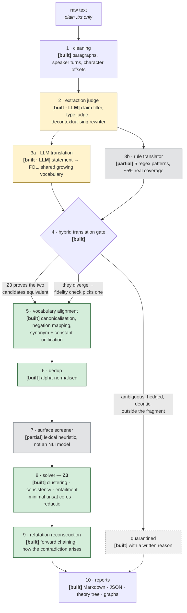

# Architecture

This document describes what the system **actually does today**, stage by stage,
and marks clearly where the implementation is partial or where a component is
still planned. `Architecture-target.pdf` in this folder is the original design
sketch and is deliberately more ambitious than the current build — treat it as a
roadmap, not a description.

Legend used throughout: **[built]** works today · **[partial]** exists in a
reduced form · **[planned]** designed, not implemented.

---

## The pipeline



Yellow marks the two stages where a language model is used. Green is
deterministic, auditable code. Grey marks components that exist but in a reduced
form. **The division is the central design claim: the model proposes, Z3
disposes.** No logical verdict is ever produced by a language model.

The exact runtime order is visible in `consistency_checker/pipeline.py`, where every stage is
timed:

```
read_and_clean → extraction → translation → gate → bridges
   → unify_predicates → dedup → screener → solver → write_outputs
```

---

## Stage notes

**1 · Cleaning** — deterministic. Establishes the character offsets that give
every later claim its provenance back to the source text.

**2 · Extraction judge** *(LLM)* — decides which sentences make claims, assigns a
type (`axiom`, `derived_claim`, `attributed`, `hypothetical`, `rhetorical`,
`non_propositional`), and rewrites each into a self-contained form. Long documents
are chunked, and each chunk's result is cached so an interrupted run resumes.

**3 · Dual translation** — the design's core redundancy. A deterministic rule
translator and the LLM each propose a formula for the same statement,
*independently*. The rule translator currently covers a small fragment (universals,
instances, simple existentials); growing it via dependency-parse composition rather
than regex is the main planned reduction in LLM reliance.

**4 · Hybrid translation gate** — arbitration. If Z3 proves the two candidates
logically equivalent, confidence is high. If they diverge, a fidelity check decides
which (if either) faithfully reflects the sentence. Anything hedged, deontic,
modal, or outside the decidable fragment is quarantined **with a recorded reason**
rather than dropped. Nothing unverified reaches the solver.

**5 · Vocabulary alignment** — the layer that makes contradictions *findable*.
Two statements only clash in Z3 if they share symbols, so this canonicalises
morphology, maps negated predicates onto their base (`Immortal` → `not Mortal`),
merges modifier variants, unifies inconsistent spellings of the same constant, and
merges curated relational synonyms with argument direction (`Prerequisite(a,b)` ≡
`Require(b,a)`). Every rewrite is recorded in the report — the merge is a lens for
the solver, never a silent edit of the author's text.

Note that vocabulary is *threaded through* the pipeline rather than being one
discrete step: the registry is created before translation, consulted during the
gate, and finalised afterwards — because the synonym merge can only run once every
predicate in the document has been seen.

**6 · Dedup** — over-extraction produces near-duplicate statements whose logic is
identical up to bound-variable naming. These collapse to one canonical node so
duplication cannot manufacture spurious derivation edges.

**7 · Surface screener** — *partial.* A lexical heuristic that flags superficially
opposed sentence pairs. It stands in the position the design reserves for a real
NLI model. Its output is informational and never affects a verdict.

**8 · Solver** — Z3. Clusters propositions by shared predicates so one bad cluster
cannot poison unrelated statements; checks each cluster for consistency; shrinks
any unsatisfiable core to a *minimal* conflicting set; establishes entailments in
layers so theorems can rest on earlier theorems, producing a derivation tree rather
than a flat fan; and treats a hypothetical as a reductio assumption, so refuting it
proves its negation instead of reading as self-contradiction.

**9 · Refutation reconstruction** — Z3 can prove a set inconsistent but cannot show
*how*, because everything follows from a contradiction. A constructive forward
chainer re-derives the two colliding chains, so the report shows the reasoning that
produced the conflict. Limited to the Horn fragment; existential contradictions
still report a minimal set without a derivation.

**10 · Reports** — Markdown, JSON, an ASCII theory tree, and graphs, all carrying
source offsets.

---

## Planned, not built

Named here so the diagram is not read as a promise:

- **Dependency parser and coreference resolution** — the syntactic layer in the
  original design. Decontextualisation is currently handled inside the extraction
  prompt instead.
- **NLI-based fidelity checking** — the fidelity gate is lexical coverage today.
  A live experiment found a general NLI check over-quarantined faithful
  translations and slowed the gate substantially, so it was narrowed to
  adjudicating genuine two-candidate divergences only.
- **Format readers** for PDF, HTML, and transcripts.
- **Solver portfolio** — TPTP export and a Vampire fallback when Z3 returns
  `unknown`.
- **Per-speaker belief sets** — currently one asserted belief set per run;
  attributed statements are excluded with a reason.
