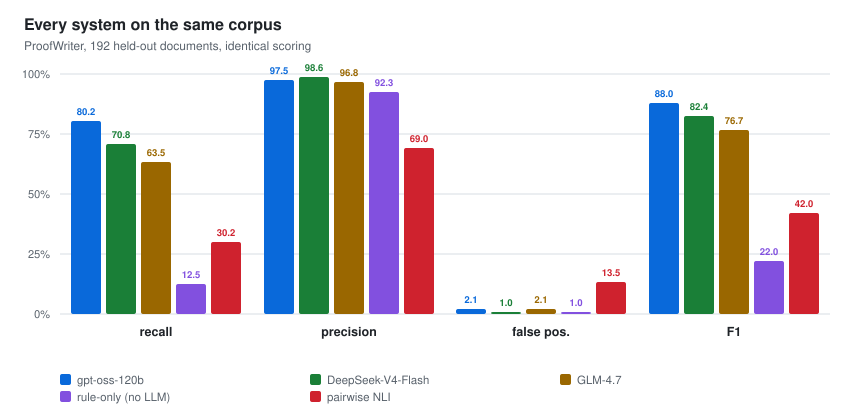
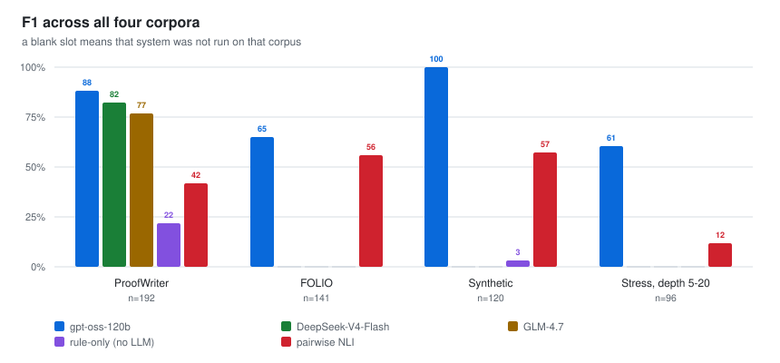
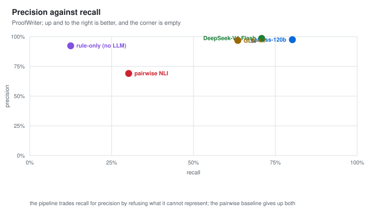

# Evaluation, system comparison

**Inconsistency Checker** · v0.8.8 · 2026‑08‑18 · fixed seed 7

Companion to [evaluation.md](evaluation.md), which reports the headline results.
This page compares every system that was run, on every corpus, with all four
detection metrics and the raw confusion counts behind them.

Five systems are compared. Three are the same pipeline with a different model
doing the translation step; one is the pipeline with that step removed entirely;
one is an external baseline.

| System | What it is |
|---|---|
| **gpt‑oss‑120b** | the pipeline, default translation model |
| **DeepSeek‑V4‑Flash** | the pipeline, translation swapped |
| **GLM‑4.7** | the pipeline, translation swapped |
| **rule‑only (no LLM)** | the pipeline with the language model withheld, deterministic translation only |
| **pairwise NLI** | sentence‑pair entailment: every pair judged in isolation, flag if any pair conflicts |

Every number below is read from the stored run metrics by `tools/compare.py`, so
the tables cannot drift from the runs that produced them. Regenerate with
`python -m tools.compare`.

---

## All systems, one corpus

ProofWriter is the only corpus on which all five ran, so it carries the
comparison. Recall separates them; **precision does not**. Four of the five sit
above 92% precision, and the one that does not is the baseline.

---

## Full results

### ProofWriter (n=192)

| System | Recall (95% CI) | Precision | False pos. | F1 | TP/FP/FN/TN | Cost/doc |
|---|---|---|---|---|---|---|
| gpt-oss-120b | **80.2%** [71.1-86.9] | 97.5% | 2.1% | **88.0%** | 77/2/19/94 | 5,168 tok |
| DeepSeek-V4-Flash | 70.8% [61.1-79.0] | **98.6%** | **1.0%** | 82.4% | 68/1/28/95 | 4,924 tok |
| GLM-4.7 | 63.5% [53.6-72.5] | 96.8% | 2.1% | 76.7% | 61/2/35/94 | 18,381 tok |
| rule-only (no LLM) | 12.5% [7.3-20.6] | 92.3% | 1.0% | 22.0% | 12/1/84/95 | offline |
| pairwise NLI | 30.2% [21.9-40.0] | 69.0% | **13.5%** | 42.0% | 29/13/67/83 | 103.2 calls |

### FOLIO (n=141)

| System | Recall (95% CI) | Precision | False pos. | F1 | TP/FP/FN/TN | Cost/doc |
|---|---|---|---|---|---|---|
| gpt-oss-120b | **50.0%** [38.7-61.3] | **92.3%** | **4.3%** | **64.9%** | 36/3/36/66 | 4,269 tok |
| pairwise NLI | 45.8% [34.8-57.3] | 71.7% | 18.8% | 55.9% | 33/13/39/56 | 16.7 calls |

### Synthetic (n=120)

| System | Recall (95% CI) | Precision | False pos. | F1 | TP/FP/FN/TN | Cost/doc |
|---|---|---|---|---|---|---|
| gpt-oss-120b | **100%** [94.0-100.0] | 100% | 0.0% | **100%** | 60/0/0/60 | 3,045 tok |
| rule-only (no LLM) | 1.7% [0.3-8.9] | 100% | 0.0% | 3.3% | 1/0/59/60 | offline |
| pairwise NLI | 40.0% [28.6-52.6] | 100% | 0.0% | 57.1% | 24/0/36/60 | 21.9 calls |

### Stress, depth 5 to 20 (n=96)

| System | Recall (95% CI) | Precision | False pos. | F1 | TP/FP/FN/TN | Cost/doc |
|---|---|---|---|---|---|---|
| gpt-oss-120b | **47.9%** [34.5-61.7] | 82.1% | 10.4% | **60.5%** | 23/5/25/43 | 21,556 tok |
| pairwise NLI | 6.2% [1.1-28.3] | 100% | 0.0% | 11.8% | 1/0/15/16 | 127.2 calls |

---

## F1 across corpora

A flat line at the axis marks a system that was not run on that corpus, not a
score of zero. **DeepSeek and GLM were only run on ProofWriter**, so the model
comparison rests on that corpus alone and should not be generalised to the
others without running them.

The pipeline leads on F1 on all four corpora. The margin is widest where the
reasoning is deepest (60.5 against 11.8 on the stress set) and narrowest on
FOLIO (64.9 against 55.9), whose contradictions are shallower and more lexical.

---

## The trade-off each system makes

The systems do not sit on a single quality axis; they choose different
trade‑offs, and the shape of that choice matters more than the ranking.

**The pipeline buys precision by refusing.** Content it cannot represent is
quarantined with a written reason instead of guessed at, which costs recall and
protects precision. Rule‑only is the same policy at its limit: 92.3% precision on
12.5% recall, because the little it does translate, it translates soundly.

**The baseline gets neither.** 30.2% recall at 69.0% precision, with a **13.5%
false‑positive rate**: it flags roughly one clean document in seven. That figure
also explains why its recall does not fall to zero at depth. A method that flags
one in seven clean documents will sometimes flag a contradictory one for the
wrong pair and be scored correct, so part of its deep‑chain recall is a lucky
guess rather than a found chain.

**Cost runs the other way from accuracy.** The baseline is the most expensive
per document, at 103 model calls against a single pass, because it grows with the
square of document length. On the stress set that reaches 127 calls per document
for 6.2% recall.

---

## Reading the model comparison carefully

The three translation models differ by 17 points of recall, but their intervals
overlap: gpt‑oss [71.1‑86.9] against GLM [53.6‑72.5] barely separate, and
gpt‑oss against DeepSeek not at all. Treat the ordering as suggestive.

They were also **not run under identical conditions**. gpt‑oss cannot disable
internal reasoning on its provider; DeepSeek can. GLM emitted 18,381 tokens per
document against gpt‑oss's 5,168 for the worst result of the three, so it is
slower and more expensive as well as less accurate.

What the comparison does establish is the size of the language model's
contribution, and it is large: withholding it drops recall from 80.2% to 12.5% on
ProofWriter and from 100% to 1.7% on the synthetic set, while precision barely
moves. **Recall is bounded by translation coverage**, not by the reasoning
engine, and that is where further work belongs.

---

*Scope: this page compares the pipeline against sentence‑pair entailment.*
