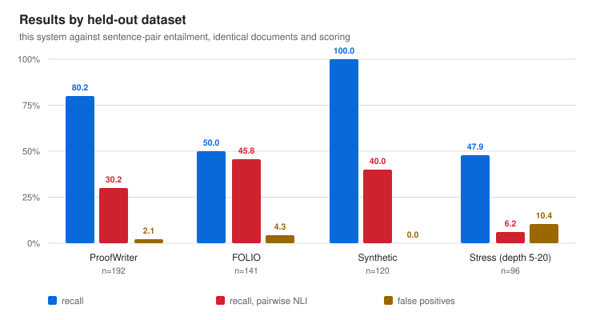
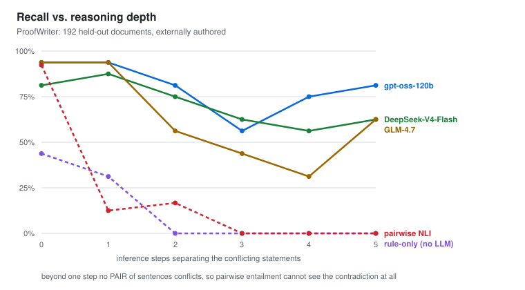
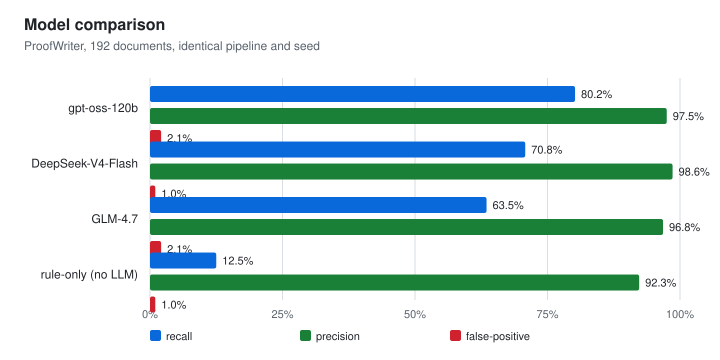

# Evaluation

**Inconsistency Checker** · v0.8.8 · 2026‑08‑17 · fixed seed 7

The system extracts claims from a document, translates each into first‑order logic,
and gives every logical judgement to the Z3 solver. It reports the *minimal* set of
statements that cannot all be true, together with a derivation of the conflict.

**Evaluated on three held‑out datasets which none was used during development.** Two are
externally authored with external labels; the third is generated so its labels follow
from construction rather than from inspection.

---

## Headline results

| Dataset | n | Source | Recall (95% CI) | Precision | False positives |
|---|---|---|---|---|---|
| **ProofWriter** | 192 | external | **80.2%** [71.1–87.0] | **97.5%** | **2.1%** |
| **FOLIO** | 141 | external | 50.0% [38.8–61.3] | 92.3% | 4.3% |
| **Synthetic** | 120 | constructed | 100% [94.0–100] | 100% | 0.0% |

Balanced by construction (ProofWriter 96/96, FOLIO 72/69, synthetic 60/60), so recall
and false‑positive rate are measured on equal numbers of positive and negative
documents. Intervals are Wilson score intervals.

---

## Recall does not degrade with reasoning depth

The central claim. A contradiction distributed across *k* inference steps is invisible
to any method that compares sentences pairwise: at *k* ≥ 2 **no pair of sentences is
inconsistent**, so pairwise entailment scores 0% by construction. The full pipeline
holds 56–81% through depth 5.

The dashed line is the same pipeline with the language model removed from translation
(§ ablation). It collapses to 0% beyond depth 1.

---

## Model comparison and the LLM's contribution

| Model | Recall | Precision | FP | Tokens/doc | s/doc |
|---|---|---|---|---|---|
| gpt‑oss‑120b | **80.2%** | 97.5% | 2.1% | 5,168 | **6.9** |
| DeepSeek‑V4‑Flash | 70.8% | **98.6%** | **1.0%** | **4,924** | 59.1 |
| GLM‑4.7 | 63.5% | 96.8% | 2.1% | 18,381 | 31.6 |
| *rule‑only (LLM withheld)* | *12.5%* | *92.3%* | *1.0%* | *0* | *offline* |

**Ablation.** Withholding the LLM translator while leaving extraction, the gate, the
solver and reporting untouched drops recall from **80.2% → 12.5%** (and 100% → 1.7% on
the synthetic set). Recall is therefore bounded by *translation coverage*, not by the
reasoning engine — the deterministic translator currently produces usable logic for
about 5% of real sentences. This is the primary target for future work.

**Precision never falls below 92% in any configuration, including with no LLM at all.**
The system does not manufacture contradictions.

Model recall differences have overlapping confidence intervals and should be read as
suggestive, not established. The models were not run under identical settings: gpt‑oss
cannot disable internal reasoning on its provider, DeepSeek can.

---

## Method

Every verdict is a Z3 proof, not a model judgement. The language model only proposes
formulas. Content outside the supported fragment (modality, tense, arithmetic,
comparatives, hedged generalisations) is **quarantined with a written reason** rather
than guessed at; quarantine rates were 3.2% (ProofWriter), 7.5% (FOLIO), 2.7%
(synthetic). ProofWriter and FOLIO are entailment datasets, converted to consistency
checking by appending the negated conclusion: a theory entails *Q* exactly when the
theory together with *¬Q* is inconsistent. The conversion rule was fixed before any
result was seen.

**Reproducibility.** Fixed seed and temperature 0; the full test suite (255 tests) runs
offline against shipped fixtures with no API key. Datasets, adapters, scorer and charts
are in `tools/`; per‑document outputs and `metrics.json` for every run are retained.

**Limitations.** The synthetic set was authored by us and exercises the fragment the
system targets; the external results are the load‑bearing ones. The depth‑3 dip is
non‑monotonic across all three models and is a sampling artefact at 16 documents per
cell, not a depth effect. Performance tracks how *logical* a contradiction is:
conflicts resting on arithmetic, dates, degree or world knowledge are outside the
representation by design.
