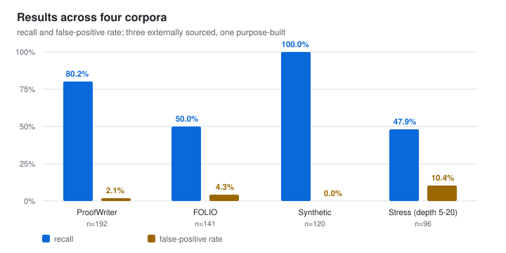
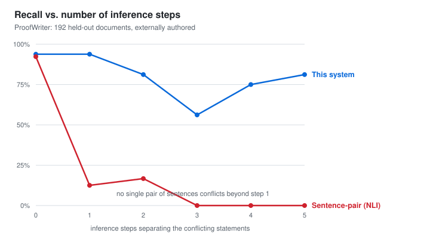
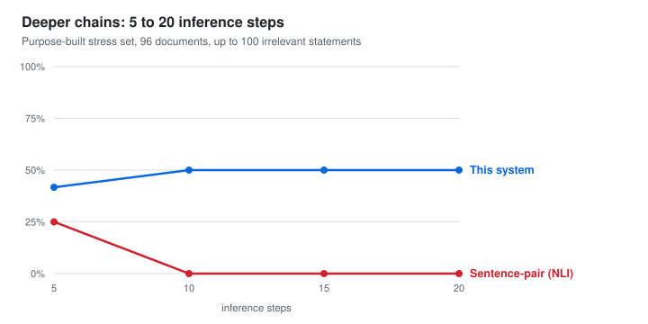

# Evaluation

**Finding contradictions that span several steps of reasoning, and proving them.**
Measured on 549 documents from three external corpora and one purpose-built
stress set. v0.8.8 · gpt‑oss‑120b · seed 7 · every figure reproducible from
`tools/evaluate.py`.

---

## What is being measured

The system reads a document, translates each statement into first-order logic,
and asks a solver whether the statements can all be true at once. When they
cannot, it returns a **minimal conflicting set** and the derivation that reaches
the conflict — not a verdict, but a proof that can be checked independently.

The evaluation asks two questions. Does it find real contradictions? And does it
invent ones that are not there? The second matters more: a checker that reports
spurious conflicts is worse than none.

Rates are reported with Wilson 95% confidence intervals. The intervals are not
decoration — on 96 documents a single flip moves a rate by more than a point, and
a reader entitled to ask "is that difference real?" needs them to answer.

---

## Results

| Corpus | n | Recall (95% CI) | False pos. | Precision | F1 |
|---|---|---|---|---|---|
| ProofWriter | 192 | 80.2% [71.1–87.0] | 2.1% | 97.5% | 88.0 |
| FOLIO | 141 | 50.0% [38.8–61.3] | 4.3% | 92.3% | 64.9 |
| Synthetic | 120 | 100% [94.0–100] | 0.0% | 100% | 100 |
| Stress (depth 5–20) | 96 | 47.9% [34.5–61.7] | 10.4% | 82.1% | 60.5 |

ProofWriter and FOLIO are externally authored and were not used during
development. **Precision stays above 92% everywhere**, which is the property the
design optimises for.

---

## The multi-hop result

The standard approach to contradiction detection is sentence-pair entailment
(NLI): compare statements two at a time and flag any conflicting pair. It has a
structural limit. When a contradiction only emerges after chaining several
statements together, **no individual pair of sentences conflicts**, and a method
that only ever looks at pairs cannot see it.

Both systems ran on identical documents under identical scoring. At zero steps —
where the contradiction is directly visible in one pair — they are level, 93.8%
against 92.3%. **At one step the pairwise method collapses to 12.5% and by three
steps it reaches 0%**, while this system stays above 56% through the deepest
level the corpus contains.

Pushing the same axis further, on a purpose-built set reaching 20 steps with up
to 100 irrelevant statements added as clutter:

| Depth 5–20, 32 documents | Recall | False pos. | Calls per document |
|---|---|---|---|
| This system | **47.9%** | 10.4% | ~3 + solver |
| Sentence-pair (NLI) | 6.2% | 0.0% | **127.2** |

The pairwise method reaches 25% at depth 5 and **0% at every deeper level**,
while making 127 model calls per document — its cost grows with the square of
document length, so the approach becomes more expensive exactly where it stops
working. This system's recall is flat across depth, because a solver is
indifferent to how long a chain is.

---

## Where the limit actually is

Recall is flat at roughly 50% on the stress set *at every depth, including the
shallowest*. That is not a reasoning failure — the solver handles 20 steps as
easily as 5. It means a document is lost when **any single statement fails to
translate**, since one missing link breaks a chain of any length.

Withholding the language model and translating with hand-written rules only,
changing nothing else, isolates this:

| | Full pipeline | Rules only |
|---|---|---|
| ProofWriter | 80.2% | **12.5%** |
| Synthetic | 100% | **1.7%** |

Precision stays above 92% even with rules alone — deterministic translation is
**sound but narrow**, yielding usable logic for a small fraction of real
sentences. Translation, not solving, is the bottleneck. It is measured here two
independent ways, and it is where further work belongs.

Three models were compared on ProofWriter under the same conditions
(gpt‑oss‑120b 80.2%, DeepSeek‑V4‑Flash 70.8%, GLM‑4.7 63.5%); the confidence
intervals overlap, so the ordering is suggestive rather than established.

---

## Limitations

- **Recall is bounded by translation coverage, not by the solver.** Roughly half
  the stress documents lose at least one statement in translation.
- **Only first-order structure is representable.** Contradictions resting on
  arithmetic, dates, degree or vagueness fall outside the fragment by
  construction, and no choice of model changes that.
- **Directly prompting a strong language model to judge a whole document is a
  serious alternative and is not evaluated here.** The comparison in this report
  is against sentence-pair entailment specifically. A language model reading the
  whole document does not face the pairwise structural limit, and any claim about
  relative detection accuracy against that approach would need its own
  experiment.
- **What the system offers over any prompting approach is a checkable artefact**
  — a minimal conflicting set and a derivation — rather than an unverifiable
  judgement. This report measures detection; it does not attempt to measure the
  value of that artefact.
- Confidence intervals on the stress set are wide (n=96, 48 positive).

---

*Corpora: ProofWriter (Allen Institute for AI, CC BY 4.0) · FOLIO (Yale LILY,
CC BY-SA 4.0) · synthetic and stress sets generated by `tools/make_stress_set.py`
with recorded seeds. Reproduce with `python -m tools.evaluate --set validation/proofwriter`.*
