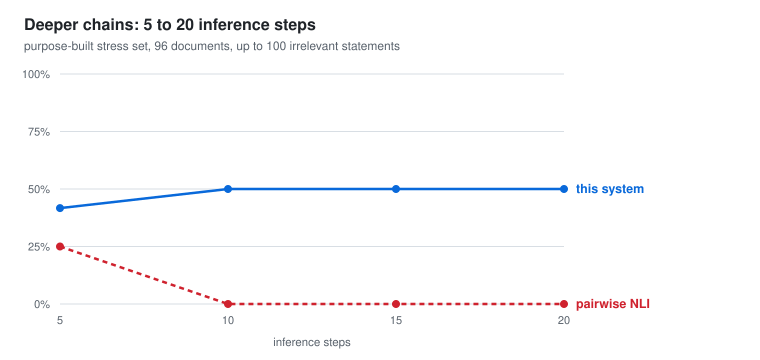

# Evaluation

**Inconsistency Checker** · v0.8.8 · 2026‑08‑18 · fixed seed 7

The system extracts claims from a document, translates each into first‑order logic,
and gives every logical judgement to the Z3 solver. It reports the *minimal* set of
statements that cannot all be true, together with a derivation of the conflict.

**Evaluated on four held‑out datasets, none of which was used during development.**
Two are externally authored with external labels; two are generated so their labels
follow from construction rather than from inspection. Every result is compared against
a **sentence‑pair entailment (NLI) baseline** run on identical documents under
identical scoring.

---

## Headline results

| Dataset | n | Recall | Precision | False pos. | NLI recall | NLI precision | NLI false pos. |
|---|---|---|---|---|---|---|---|
| **ProofWriter** | 192 | **80.2%** [71.1–86.9] | **97.5%** | **2.1%** | 30.2% | 69.0% | 13.5% |
| **FOLIO** | 141 | 50.0% [38.7–61.3] | 92.3% | 4.3% | 45.8% | 71.7% | 18.8% |
| **Synthetic** | 120 | 100% [94.0–100] | 100% | 0.0% | 40.0% | 100% | 0.0% |
| **Stress (depth 5–20)** | 96 | 47.9% [34.5–61.7] | 82.1% | 10.4% | 6.2% | 100% | 0.0% |

The pipeline leads on recall on all four corpora and on false positives on the two
externally authored ones, where the baseline flags **13.5%** and **18.8%** of clean
documents against our 2.1% and 4.3%. A per-system breakdown with confusion counts and
every model is in [evaluation2.md](evaluation2.md).

Balanced by construction (ProofWriter 96/96, FOLIO 72/69, synthetic 60/60, stress
48/48), so recall and false‑positive rate are measured on equal numbers of positive and
negative documents. Intervals are Wilson score intervals.

---

## Recall does not degrade with reasoning depth

The central claim. A contradiction distributed across *k* inference steps is invisible
to any method that compares sentences pairwise: at *k* ≥ 2 **no pair of sentences is
inconsistent**, so pairwise entailment cannot see the conflict at all.

This is measured, not asserted. On all 192 documents the NLI baseline scores **100% at
depth 0**, where the contradiction is directly visible in a single pair, then collapses to
**6.2% at depth 1** and stays between 12% and 31% thereafter. The full pipeline holds
56–81% across the same range.

Its residual recall at greater depths should be read next to its **13.5% false-positive
rate**: a method that flags one clean document in seven will also flag contradictory ones
for the wrong reason, so some of that residue is a lucky guess rather than a found chain.
Precision bears this out, 69.0% against the pipeline's 97.5%.

The dashed purple line is the same pipeline with the language model removed from
translation (§ ablation). It collapses to 0% beyond depth 1 for a different reason:
coverage, not structure.

---

## Beyond the public corpora: 20 inference steps

ProofWriter tops out at 5 steps. A purpose‑built set extends the axis to 20, crossed
with 0, 40 and 100 irrelevant statements so that depth and document length vary
independently. Distractors reuse the same predicate vocabulary on *other* entities, so
they cannot be dismissed by surface similarity.

| Depth 5–20 | Recall | False positives | Model calls per document |
|---|---|---|---|
| **This system** | **47.9%** | 10.4% | ~3 + solver |
| Sentence‑pair (NLI) | 6.2% | 0.0% | **127.2** |

The pairwise baseline reaches 25% at depth 5 and **0% at every deeper level**, while
making 127 model calls per document, and its cost grows with the square of document length,
so it becomes most expensive exactly where it stops working. Our recall is *flat* across
depth, because a solver is indifferent to chain length.

That flatness is also the diagnosis: recall sits near 50% at **every** depth including
the shallowest, so the loss is not depth‑related. A document fails when any single
statement fails to translate, and one missing link breaks a chain of any length.

---

## Model comparison and the LLM's contribution

| Model | Recall | Precision | FP | Tokens/doc | s/doc |
|---|---|---|---|---|---|
| gpt‑oss‑120b | **80.2%** | 97.5% | 2.1% | 5,168 | **6.9** |
| DeepSeek‑V4‑Flash | 70.8% | **98.6%** | **1.0%** | **4,924** | 59.1 |
| GLM‑4.7 | 63.5% | 96.8% | 2.1% | 18,381 | 31.6 |
| *rule‑only (LLM withheld)* | *12.5%* | *92.3%* | *1.0%* | *0* | *offline* |

**Ablation.** Withholding the LLM translator while leaving extraction, the gate, the
solver and reporting untouched drops recall from **80.2% → 12.5%** (and 100% → 1.7% on
the synthetic set). Recall is therefore bounded by *translation coverage*, not by the
reasoning engine: the deterministic translator currently produces usable logic for
about 5% of real sentences. This is the primary target for future work.

**Precision never falls below 92% in any configuration, including with no LLM at all.**
The system does not manufacture contradictions.

Model recall differences have overlapping confidence intervals and should be read as
suggestive, not established. The models were not run under identical settings: gpt‑oss
cannot disable internal reasoning on its provider, DeepSeek can.

---

## Method

Every verdict is a Z3 proof, not a model judgement. The language model only proposes
formulas. Content outside the supported fragment (modality, tense, arithmetic,
comparatives, hedged generalisations) is **quarantined with a written reason** rather
than guessed at; quarantine rates were 3.2% (ProofWriter), 7.5% (FOLIO), 2.7%
(synthetic). ProofWriter and FOLIO are entailment datasets, converted to consistency
checking by appending the negated conclusion: a theory entails *Q* exactly when the
theory together with *¬Q* is inconsistent. The conversion rule was fixed before any
result was seen.

**Baseline.** Sentence‑pair entailment judges every pair of statements independently and
flags the document if any pair conflicts. Each judgement sees only its two sentences.
That isolation is the method, so pairs are never batched into one prompt, which would
let the model reason across them. It is scored by the same rule and the same labels as
the pipeline. On the two external corpora it reaches 30.2% and 45.8% recall, at 13.5% and
18.8% false positives, against the pipeline's 80.2% and 50.0% at 2.1% and 4.3%.

**Reproducibility.** Fixed seed and temperature 0; the full test suite (255 tests) runs
offline against shipped fixtures with no API key. Datasets, adapters, scorer, baseline
and charts are in `tools/`; per‑document outputs and `metrics.json` for every run are
retained.

**Limitations.** The generated sets were authored by us and exercise the fragment the
system targets; the external results are the load‑bearing ones. The depth‑3 dip is
non‑monotonic across all three models and is a sampling artefact at 16 documents per
cell, not a depth effect. Performance tracks how *logical* a contradiction is: conflicts
resting on arithmetic, dates, degree or world knowledge are outside the representation by
design. The comparison here is against sentence‑pair entailment specifically; prompting a
language model to judge a whole document at once is a different approach that does not
face the pairwise structural limit, and is not evaluated in this report.
